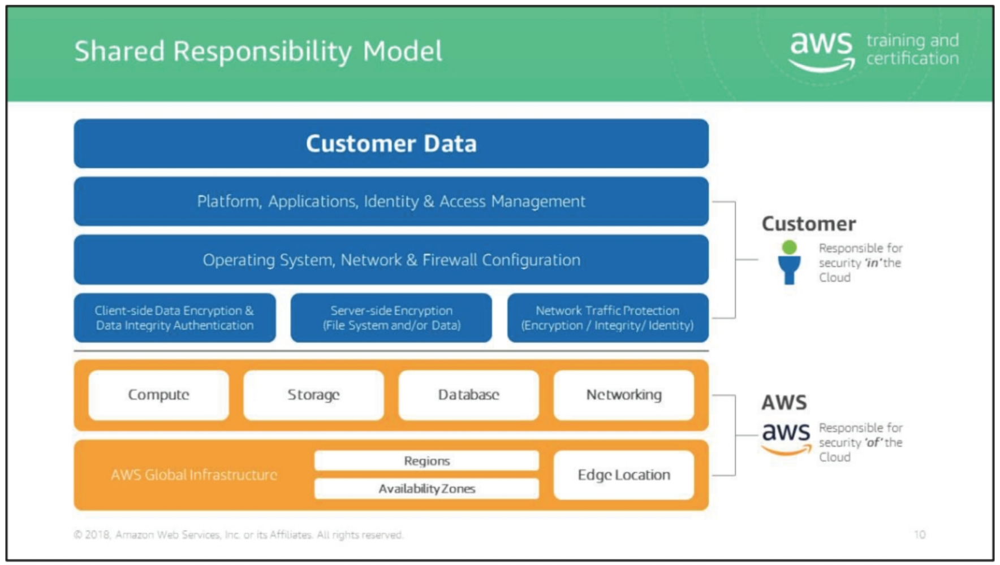

# AWS Developer Certification Bootcamp

## Domains
1. AWS Fundamentals
2. Designing and Developing
3. Deployment and Security
4. Debugging

## Domain 1 (AWS Fundamentals)

Cloud Architecture Principles
1. Design for Failure and Nothing will Fail
2. Embrace Elasticity and Automation
    - Favor dynamic configuration (introducing load balancing)
3. Loose Coupling Sets You Free
    - Load balancing
    - SQS, SNS (use queues to pass messages between components)
4. Design Stateless Applications
    - Do not store application state on servers
    - Leverage services to store state information (DynamoDB)
5. Think Parallel
    - Favor horizontal scaling
6. Leverage Different Storage Options (**important**)
    - Log clicks to NoSQL data stores instead of RDBMS
    - Store images in object storage instead of RDBMS
    - Off-load log files to scalable object storage
    - *Understand different storage solutions!*
7. Build Security into Every Layer
    - Enforce principle of least privilege across every service

#### Trade-off Considerations (Databases)

## Domain 2 (Designing and Developing)

### Amazon S3

**Key concepts**:
- Bucket
- Object

**Best practices**:
- Workloads that include a mix of request types
- Workloads that are GET-intensive (caching)
    - **CloudFront** for caching

### DynamoDB

**Key concepts**:
- Tables (unit of provisioning)
    - **Partition key** and **sort key** attributes are important
- Secondary index
    - Alternate key to query with non-primary key attributes
    - **No more than 10 GB of data per ID**
- Streams
- Data consistency (eventually consistent vs. strongly consistent reads)
- Throughput 
    - **Read capacity units (RCU)**
    - **Write capacity units (WCU)**

### Event-Driven Solutions

- Amazon SNS (topic, subscriber, message size)
- Amazon SQS (messages on a queue, no guarantee on delivery order)
    - **API parameter names**
    - Understand distinction between SNS and SQS
- Amazon SWF (provision a domain, define workflow)
- Amazon StepFunctions (JSON)

### Lambda

**Function invocation**:
- Event source (push model)
- Stream-based services (pull model)
- Direct invocation (request-response model)

### API Gateway

### Kinesis Streams

**Key concepts**:
- Data record
- Stream
- Shard
    - Reads: **5 TPS**, total: 2 MB / second
    - Writes: **1000** records per second, total: 1 MB / second
    - **Preserves ordering of records** (contrast to SQS)
- Producer
- Consumer

### Scalability -- Caching

### CloudFront (Caching)

- Cache behavior: path patterns, request headers, query strings, cookies
- TTL: short vs long TTL
- Restricting access: using signed URLs or signed cookies
- URLs or cookies are hashed and signed using the private key from a
  public/private key pair

### ElastiCache

- Cluster: logical grouping of one or more nodes
- Node: Smallest building block of ElastiCache deployment
- Runs Memcached or Redis in-memory key-value engine
- Endpoint: unique address (within VPC, private IP address)
- Replication group: collection of Redis clusters

### Two patterns for populating cache

1. Lazy loading
    - Loads data into the cache only when necessary
2. Write through
    - Adds data or updates data in the cache whenever data is written to the DB

### CloudWatch

**Key concepts**:
1. Metrics (have retention period)
2. Alarms
3. Period
4. Statistics
5. StatisticSets
6. Logs

## Domain 3 (Deployment and Security)

Know **CloudFormation** and **EC2**

#### Deploying Highly Available and Scalable Applications

### Elastic Beanstalk

- Deploys applications without worrying about details of underlying tech
- Components: environment, application versions, configuration
- Permission model: service role, instance role

### CloudFormation

- **Template**: basic definition of resources to create, JSON and YAML
    - **Look at snippets of CloudFormation templates**
    - Key pieces of CloudFormation template
- Stack: create from templates, create multiple stacks, monitor progress of
  stack updates

#### Shared Responsibility Model

### Virtual Private Cloud

Logically isolated section of the virtual network you defined.

- Basic concepts of the VPC and its components
- How to design and configure it to meet security mandates
    - Subnet
    - Network ACL (stateless, can **deny** traffic)
    - Route table
    - Security group (firewall -- stateful, only **allows** traffic)
    - VPN
    - VPC flow logs

Penetration testing **requires written permission**.

#### Data encryption

- Unsupported: ElastiCache and EC2

### Identity and Access Management (IAM)

- IAM User
- Policy
- Group
- Role

#### Identity Federation

- Authenticating using **external identities** (federated users)
- Web identity federation
- SAML 2.0

### STS (Security Token Service)

- Provides trusted (federated) users and IAM users with temporary security
  credentials
    - Assume role
    - Temporary credentials
    - Configurable credential lifetime
- Uses IAM policies to control permissions
- Supports SAML 2.0

### IAM Best Practices

1. Do not use root account
2. Use IAM group for better management
3. Grant least privilege
4. Enable multi-factor authentication (MFA)
5. Use roles instead of sharing credentials
6. Rotate credentials regularly
7. Use policy conditions for extra security

## Domain 4 (Debugging)

**General**:
1. Check AWS error code
2. Check permission access
3. CloudWatch monitoring (view metrics and set alarms)
4. CloudTrail (captures API calls)

**S3**:
1. Enable logging
2. Check request ID pair
3. Enable server access logging

**DynamoDB**:
1. Monitor using CloudWatch
2. Log API calls using CloudTrail

**Lambda**:
1. DryRun invocation type (checks permissions)
2. Use CloudWatch (invocations, duration, errors, throttles)
3. Log API calls using CloudTrail

**EC2**:
1. Instance connectivity
2. Gateway (IGW or VPG) attached
3. Routing rules
4. Elastic IP or public IP of instance
5. Network ACL
6. Security groups
7. OS-level firewalls

### Preparing for the Exam

- Read service FAQs
- API documentation
- Take practice exam
